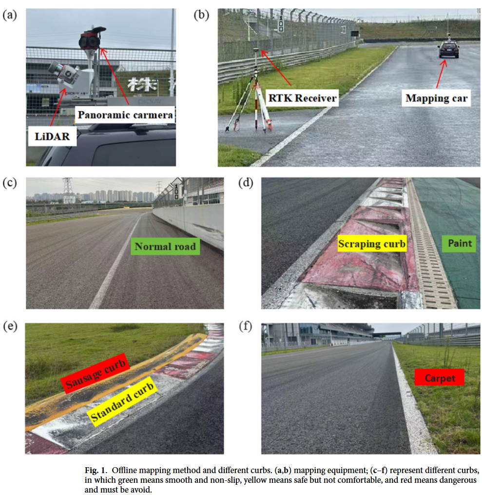
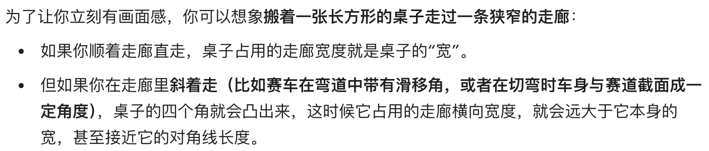
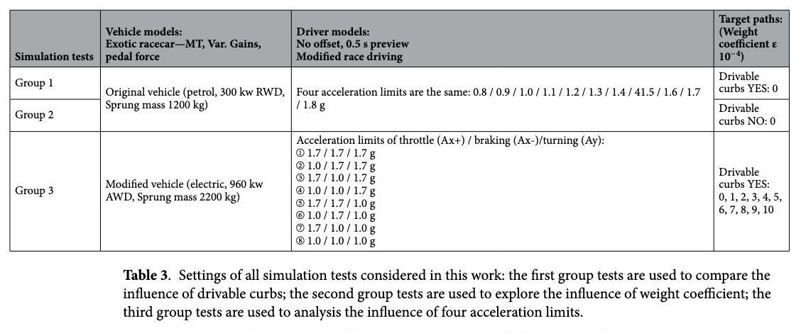
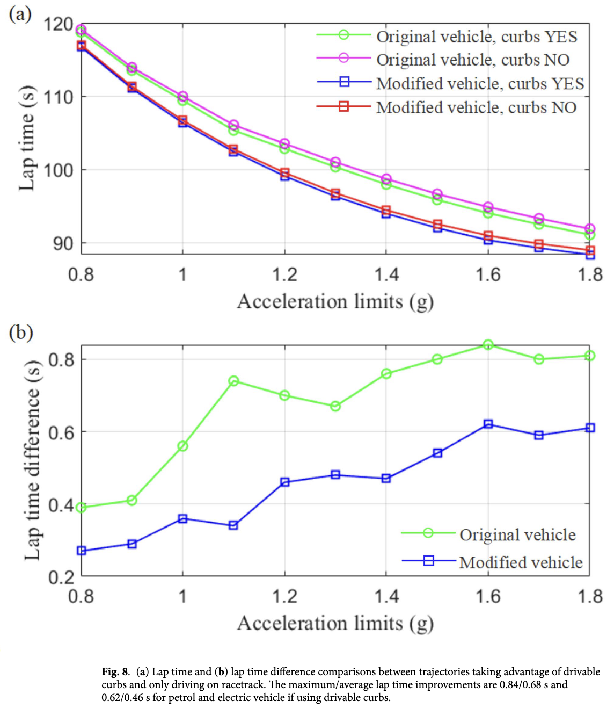
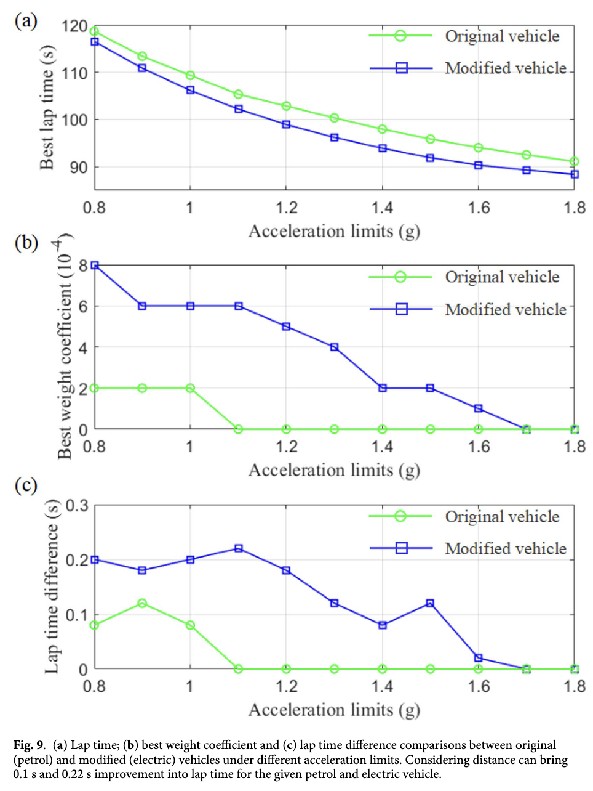
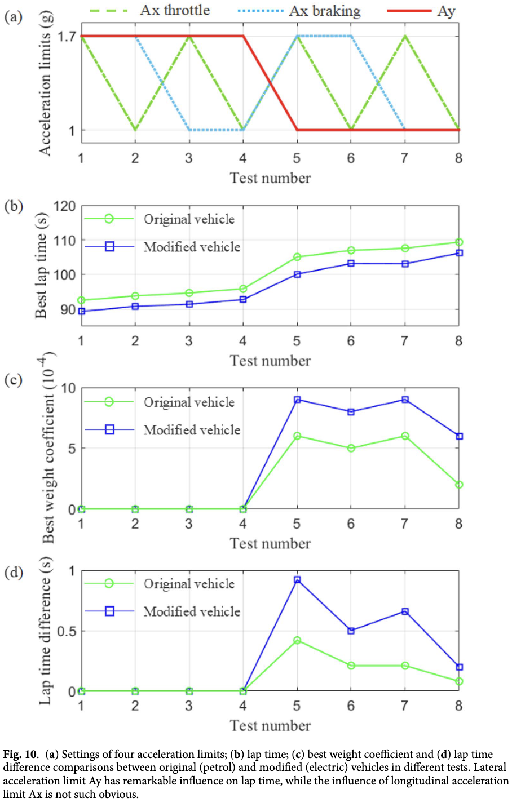
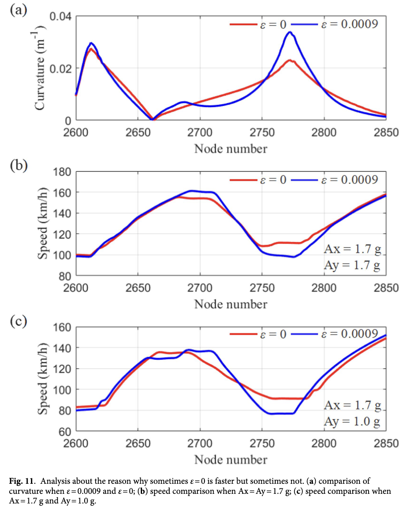

# Global minimum time trajectory  planning considering curvature and  distance for track racing

# 摘要

本文重点研究基于赛道离线高精度地图的赛道竞速全局最小时间轨迹规划，同时考虑了曲率和距离因素。首先介绍了赛道的离线映射、后处理以及一种新的网格化方法。然后，根据二次规划方法的要求，分别推导了离散平方距离之和与离散平方曲率之和，并通过权重系数将两者结合，构成最小时间轨迹的目标函数。在约束条件中，考虑了可行驶路肩、车辆尺寸和安全距离，以充分利用赛道宽度。利用目标函数和约束条件，采用二次规划方法计算并迭代出平滑合理的轨迹。在 **CarSim** 中模拟了燃油和电动赛车、不同驾驶员模型以及不同轨迹。结果表明，如果利用可行驶路肩，可以获得显著改进；不同车辆和驾驶员的最小时间轨迹显示出显著差异。

# 关键词

轨迹优化；二次规划；曲率与距离；最小时间；电动赛车

# 1 引言

轨迹规划的任务是找到从起点到终点的空间连续路径，该路径应确保车辆运动的可靠性、安全性和舒适性，并满足环境约束、时间约束和车辆运动学约束。随着智能辅助驾驶技术的快速发展，轨迹规划已应用于许多场景，如高速公路变道、城市道路交叉口转弯、自动泊车，甚至赛道自动驾驶。不同驾驶场景使用的轨迹规划算法也不同，广泛使用的算法包括基于图搜索的算法、基于采样的算法、基于优化的算法以及深度强化学习方法。

变道、转弯和泊车都是常规驾驶工况，而赛道竞速面临更极端的驾驶条件。为了在尽可能短的时间内完成一圈或多圈，研究人员提出了许多规划方法，以基于合理的驾驶轨迹来缩短单圈时间。赛道轨迹规划方法根据规划范围可分为两类：局部规划和全局规划。

**局部轨迹规划**主要旨**在固定的时间步长内**规划车辆的操作（加速、制动和转向），以找到最佳驾驶轨迹。当前的局部轨迹规划方法主要使用控制优化算法。Funke 以及 Kalaria 等人使用局部轨迹优化来修正全局规划轨迹并实现避障。Evans 等人提出了一种针对未映射赛道的局部地图框架，利用易于提取的低级特征构建可见区域的局部地图，其单圈时间仅比全局方法慢3.28%。

**全局规划**涉及**在可行驶区域边界内**，基于单圈时间、轨迹几何形状和能耗等特定目标，寻找**从起点到终点的完整驾驶轨迹**。一些研究人员利用最优控制理论，以单圈时间为目标优化轨迹规划。Metz 等人通过建立优化控制问题并将其转化为两点边值问题，使用准线性化方法求解。Pagot 等人提出了一种非线性在线 MPC 优化控制框架，用于求解赛道的最短时间轨迹，并在1:8遥控车上进行了测试，结果显示轨迹接近时间最优轨迹。Kelly 等人和 Rucco 等人分别使用序列二次规划（SQP）和投影算子牛顿法数值优化控制方法获得了时间最优轨迹。这类轨迹规划方法需要大量的复杂车辆模型参数，参数的任何变化都会对生成的轨迹产生重大影响，导致计算工作量较大。

轨迹的几何特性也会影响单圈时间。Braghin等人首先计算**最短路径**和**最小曲率路径**，然后通过**单一权重系数**将它们结合起来**生成最佳赛车线**。基于Braghin的工作，Cardamone等人将赛道分解为几个路段，并使用一组权重系数生成最佳赛车线。这两项工作的不足之处在于，获得的赛车线总是不够平滑，因为最短路径在弯道处转弯过急。Kapania等人将轨迹规划分解为两个步骤，以解决轨迹规划算法中计算复杂度高的问题：生成最小时间的速度曲线和生成最小曲率轨迹。实验结果表明，与非线性梯度下降算法相比，该方法可以快速生成最优轨迹。Heilmeier等人提出了一种使用二次规划（QP）生成最小曲率轨迹的方法，该方法可以大大减少算法参数并提高计算速度，并发现最小曲率轨迹接近最小时间轨迹。Li等人提出了曲率集成MPCC，在实际实验中实现了车辆操控极限93.18%的平均投影速度；还提出了另一种曲率集成MPCC，与传统MPCC相比，单圈时间减少了11.4%-12.5%。

本文重点研究基于赛道离线高精度地图的赛道竞速全局最小时间轨迹规划，参考了Heilmeier的工作，在目标函数中考虑了曲率和距离因素，这与Braghin和Cardamone的工作不同，后者只是直接将最短路径和最小曲率路径结合起来。为了充分利用赛道宽度，仔细考虑了可行驶路肩、车辆尺寸和安全距离。在CarSim中模拟了高性能燃油和电动赛车以及不同的驾驶员模型，以确定平衡最小时间轨迹中曲率和距离因素的最佳权重系数。仿真结果表明，不同车辆和驾驶员的最小时间轨迹存在显著差异。

# 2 赛道映射与后处理

映射方法可分为**在线**和**离线**两种。对于普通道路的自动驾驶，实时在线感知周围环境并获取可行驶区域的边界坐标具有重要意义。现有方法可总结为使用雷达、摄像头等设备检测物体和自由空间，然后进行后处理以获得边界坐标。这种方法可以适应不断变化的环境，其精度基本能满足日常驾驶需求。然而，这种方法也有一些缺点：(1) 对车载传感器、计算能力和算法要求高；(2) 出于安全原因，不确定区域通常被归类为不可行驶区域，因此感知到的可行驶区域通常小于实际区域。**对于赛道驾驶，赛道的边界条件几乎不变，且赛道驾驶需要充分利用赛道宽度。因此，在线感知和映射是不必要且不合适的，而离线映射是赛道驾驶的更好选择。**

我们对中国的一条赛道进行了离线映射。如图1a、b所示，使用了激光雷达（LiDAR）、全景相机、RTK等设备获取赛道边界的高精度三维（3D）坐标，以及两侧路肩的类型和位置。如图1c-f所示，赛道上有6种不同类型的边界，用不同颜色标记，包括普通路面、油漆路面、刮擦路肩、标准路肩、香肠路肩和地毯。**绿色标记的普通路面和油漆路面平滑且防滑，意味着可以充分利用它们来优化轨迹。黄色标记的刮擦路肩和标准路肩，如果悬挂系统和轮胎能承受冲击，可以驶过。红色标记的香肠路肩和地毯很危险，必须避开。**不同边界的分布如图2a所示，其中绿线代表普通路面和油漆边界；黄线代表刮擦路肩和标准路肩；红线代表香肠路肩和地毯边界。为了安全起见，需要根据驾驶技术为不同边界设置不同的安全距离。此处，绿色、黄色和红色边界的安全距离分别选为0.05米、0.05米和0.1米。根据赛车规则，至少有两个车轮应在白色实线（赛道边界）的内侧。我们要考虑车辆宽度为2米，那么图2a中白色实线到边界的距离不应超过2米。后处理后，**所有可行驶区域的边界如图2b中的黑色实线所示**，蓝色方框内的放大图如图2c所示。

现有的网格化方法是使用赛道中心线的法线，这种方法容易适应不同的赛车环境，并在各种赛道上表现出鲁棒性。然而，这种方法的一个缺点是**两点之间的离散化步长不能太小**（例如，在该赛道中步长应大于2.96米），**否则在某些弯道较急且赛道较宽的地方，某些法线会交叉**，如图3a所示。因此，我们提出了一种新的网格化方法，如图3b所示，**该方法不需要中心线的法线，而是直接连接内边界和外边界上的点**，唯一的要求是图3b中红线的分布应尽可能均匀。我们的方法对离散化步长没有限制，本工作中的平均步长仅为0.2米。

# 3 轨迹规划

在本节中，轨迹节点坐标将由边界坐标和变量 *α* 表示（见“3.1 赛车线点的符号表示”）；然后在“距离因子的描述”和“曲率因子的描述”中推导轨迹距离因子和曲率因子的二次表达式。在“最小时间轨迹的目标函数”中，将给出最小时间轨迹的目标函数，其优化变量是轨迹节点的位置（变量 *α* ），并在“约束条件”中介绍其约束条件。最后，在“轨迹计算与迭代”中描述最优轨迹的迭代求解方法。

**曲率**和**距离**是影响沿赛车线**单圈时间**的最重要因素。如果车辆性能极弱，最佳路径倾向于最短路径；否则，如果性能足够强大，车辆应沿最小曲率路径行驶。现实中的汽车轨迹规划，**需要同时考虑曲率和距离**，以实现更好的单圈时间。QP（二次规划）方法是一种快速且稳健的计算最优轨迹的方法。只要将优化问题写成公式 (1.1) 或 (1.2)，就可以直接使用MATLAB集成的 Quadprog 函数或 Stellato 等人提出的“OSQP”求解器。

<aside>
💡

为什么最佳路径的选择需要取决于车辆性能？

</aside>

## 3.1 赛车线点的符号表示

如图4所示，第 i **个赛车线点 r_i** 的符号表示为：

其中 $p_i$ 和 $q_i$ 分别是内边界点和外边界点，$v_i$ 是从 $p_i$ 到 $q_i$ 的向量。赛车线的**形状由标量 $α_i$ 控制，且 $α_i∈[0,1]$**，因为赛车线必须在可行驶区域内。公式 (2.1) 可以写成矩阵形式，即公式 (2.3)，其中 $r,p,α$ 分别为节点坐标、内边界点和决策变量的向量，$V$ 为由边界差值构成的对角矩阵。

<aside>
💡

矩阵 a 的形状为 N*1，矩阵 v 的形状为 N*N，va 的形状为 N*1。

</aside>

## 3.2 距离因子的描述

> 
> 
> 
> **二次规划（Quadratic Programming，简称 QP）**是运筹学和数学优化领域中一种非常经典且强大的数学模型。
> 
> 简单来说，它的任务是在一组**线性的限制条件**下，去寻找一个**二次函数**的最小值（或最大值）。
> 
> 为了让您更直观地理解，我们可以把它拆解为几个核心要素，并结合您刚刚阅读的论文来具体说明：
> 
> ### 1. 二次规划的标准数学形式
> 
> 一个标准的二次规划问题通常被写成如下的矩阵形式：
> 
> $$
> \min_x \left( \frac{1}{2} x^T Q x + c^T x \right)
> $$
> 
> 受限于：
> 
> $$
> A x \le b
> $$
> 
> $$
> E x = d
> $$
> 
> **2. 核心要素拆解**
> 
> - **决策变量 ($x$)**：这是算法需要求解的未知数。
>     - **在论文中**：决策变量是 $a$，它代表了赛车线上每一个离散点在赛道内外边界之间的相对位置 。
> - **目标函数（Objective Function）**：这是我们想要“最小化”或“最大化”的指标，在 QP 中，它必须包含平方项（即二次项，如 $x_1^2$ 或 $x_1 \cdot x_2$），这对应公式中的 $\frac{1}{2} x^T Q x$ 部分。
>     - **在论文中**：研究人员希望同时最小化“离散距离的平方和”与“离散曲率的平方和” 。因为它们都是“平方和”，所以恰好完美符合二次规划的目标函数形式 。
> - **约束条件（Constraints）**：这是变量必须遵守的规则，在 QP 中，约束条件必须是**线性的**（不能包含平方或更复杂的项），通常表现为直线、平面或超平面。
>     - **在论文中**：车辆必须在赛道边界内行驶，且要扣除车辆宽度和安全距离 。论文通过线性不等式 $\Psi a \le \varphi$ 将这些物理边界转化为了线性的数学约束 。
> - **为什么二次规划在工程中如此受欢迎？**
>     - **存在全局最优解**：如果目标函数中的矩阵 $Q$ 是半正定的（在几何上表现为一个开口向上的“碗”状抛物面），那么这个问题就是一个**凸优化问题**。这意味着只要找到一个极小值，它就一定是全局真正的最小值，算法不会“卡”在局部的坑里出不来。
>     - **计算速度极快且稳健**：因为它的数学性质非常良好，现代计算机和数学家们已经开发出了极其高效的求解器。
>     - **在论文中**：作者提到 QP 方法是一种快速且稳健的计算最优轨迹的方法 。只要把赛道问题套进这个公式模板，就可以直接丢给现成的求解器（如 MATLAB 自带的 quadprog 函数或 OSQP 求解器）瞬间算出结果 。
> 
> 综上所述，二次规划就是一种**在画好的直线框框里，找一个碗状抛物面最低点**的数学工具。这篇论文的精妙之处就在于，作者巧妙地把复杂的赛道几何问题，降维并转化成了这种计算机最擅长求解的标准 QP 问题。
> 

为了使用**二次规划（QP）方法**处理优化问题，我们需要**计算赛车线的总离散平方距离**。对于一个闭合回路（即一圈赛道），其计算公式为：

<aside>
💡

- **解释**:
    - `$J_s$` 是我们想要最小化的目标函数的一部分，代表整个轨迹的“距离成本”。
    - `$s_i$` 表征的是赛车线上**相邻两个离散节点之间的距离向量（位置差值）**。
    - `$r_i$` 是轨迹上第 `$i$` 个点的坐标（一个二维向量 `$[x, y]$`）。
    - `$(r_{i+1} - r_i)^2$` 表示相邻两点间距离的平方。求和符号 `$Σ$` 意味着我们将所有相邻点之间的距离平方加起来。
    - 最后一项 `$(r_1 - r_N)^2$` 是为了确保轨迹是闭合的，它将最后一个点 `$r_N$` 和第一个点 `$r_1$` 连接起来。
        - **要将赛道轨迹闭环的原因：**
        - **匹配场地赛的真实物理场景**：和从A点开到B点的拉力赛（点对点跑法）不同，标准的场地赛车都是在环形赛道上不断绕圈。为了在尽可能短的时间内完成一圈或多圈，赛车跑完当前圈的终点，无缝衔接的就是下一圈的起点 。
        
        **保证动态连续性，防止“自杀式”冲线**：如果数学模型不闭环，优化算法（QP）会认为这是一个“单程任务”，只要以最快速度冲过第 $N$ 个点（终点）就大功告成了。这样算法可能会给出一个极其极端的轨迹——比如为了抄近道，以垂直于赛道边缘的角度、甚至冲着墙壁冲线。加上 $(r_1-r_N)^2$ 这一项 ，就是强迫算法在规划终点冲线姿态时，必须考虑如何顺滑、安全地衔接回起点的第一个弯道。
        
        **实现曲率和速度的全局最优**：在论文的“闭环”模型下，赛车线不仅在距离位置上首尾相连，算法在计算“二阶导数”（即曲率）时，也会把终点和起点关联起来。这意味着赛车在跨越起跑线时的速度、加速度和走线，都能完美服务于整个持续循环的单圈最优，实现首尾平滑过渡。
</aside>

其中，`$s_i$` 可以用矩阵形式表示为：

<aside>
💡

- **解释**:
    - 这里将所有的线段长度 `$s_i$` 组合成一个向量 `$s$`。
    - 矩阵 `$A$` 是一个特殊的差分矩阵。它的作用是通过与轨迹点向量 `$r$` 相乘，来计算出所有相邻点之间的差值（即 `$r_{i+1} - r_i$`）。
    - 例如，第一行 `[-1, 1, 0, ..., 0]` 乘以 `$r$` 向量，得到的结果就是 `$r_1 + r_2$`，也就是 `$r_2 - r_1$`。
    - 最后一行 `[1, 0, ..., 0, -1]` 的作用是计算 `$r_1 - r_N$`，以实现闭环。
</aside>

因此，公式(4)的矩阵形式为：

> 作者之所以要把公式写成这个样子，是为了**强行把它凑成二次规划（QP）求解器能直接看懂的标准模板**，也就是 $\frac{1}{2} x^T H x + f^T x + c$ 的形式 。
> 
> 
> ### 第一步：代入相邻距离向量 $s$
> 
> 根据论文前面的公式 (5)，我们知道相邻节点的距离向量 $s$ 可以用矩阵表示为 $s = Ar$ 。
> 所以，距离平方和 $J_s$ 可以写成：
> 
> $$
> J_s = s^T s = (Ar)^T (Ar) = r^T A^T A r
> $$
> 
> ### 第二步：代入赛车线节点坐标 $r$
> 
> 再根据前面的公式 (2.3)，赛车线上的点 $r$ 是由内边界点 $p$、向量 $v$ 和我们的决策变量 $a$ 组成的：$r = p + va$ 。
> 把它代入上面的公式中：
> 
> $$
> J_s = (p + va)^T A^T A (p + va)
> $$
> 
> ### **第三步：矩阵乘法展开**
> 
> 根据矩阵转置的规则 $(A+B)^T = A^T + B^T$，我们把括号拆开：
> 
> $$
> J_s = (p^T + a^T v^T) A^T A (p + va)
> $$
> 
> 把这两项乘开，会得到 4 项相加：
> 
> $$
> J_s = \underbrace{a^T v^T A^T A v a}_{\text{二次项}} + \underbrace{a^T v^T A^T A p + p^T A^T A v a}_{\text{一次项}} + \underbrace{p^T A^T A p}_{\text{常数项}}
> $$
> 
> ### **第四步：合并同类项**
> 
> 在矩阵计算中，中间那两个“一次项”算出来的结果其实是一个标量（普通数字），所以它们俩是完全相等的。加在一起就可以写成 $2 a^T v^T A^T A p$。
> 
> <aside>
> 💡
> 
> **为什么两个一次项的结果是一个相等的标量？**
> 
> 在前面的展开中，我们得到了这两个一次项：$a^T v^T A^T A p$ 和 $p^T A^T A v a$。
> 
> - $a$ 是包含所有点位置比例的列向量，维度是 $N \times 1$。那么它的转置 $a^T$ 就是 $1 \times N$。
> - $v$ 构成的对角矩阵和关联矩阵 $A$ 都是 $N \times N$ 的方阵 。
> - $p$ 是包含内边界点坐标的列向量，维度是 $N \times 1$ 。
> 
> 如果我们看第一项的连乘 $a^T \times v^T \times A^T \times A \times p$ ：
> 
> $$
> (1 \times N) \times (N \times N) \times (N \times N) \times (N \times N) \times (N \times 1)
> $$
> 
> 根据矩阵乘法规则，中间的维度会依次抵消，最后的结果维度就是 **$1 \times 1$**！
> 一个 $1 \times 1$ 的矩阵，在数学上没有任何扩展结构，它就是一个普通的数字（标量）。
> 
> **在矩阵代数里有一个极其重要的定理：标量的转置等于它自己。**
> 
> 如果我们利用穿脱原则对第一项求个转置：
> 
> $$
> (a^T v^T A^T A p)^T = p^T A^T (A^T)^T (v^T)^T (a^T)^T = p^T A^T A v a
> $$
> 
> 既然它们都是代表同一个数字的标量，而且互为转置，这就意味着**它们在数值上是绝对相等的**。所以可以直接相加，合并成 $2 a^T v^T A^T A p$。
> 
> </aside>
> 
> <aside>
> 💡
> 
> **为什么以 $a$ 为决策变量？**
> 
> 这就回到了赛道建模的物理意义上了。在定义赛车线坐标的公式 $r_i = p_i + a_i v_i$ 中 ：
> 
> - **$p_i$ 是赛道的内边界点** ：这是研究人员用激光雷达和 RTK 提前扫好的地图数据 ，它是**固定不变的已知常数**。
> - **$v_i$ 是从内边界指向外边界的向量** ：也就是赛道在这一点的“宽度”和“方向”，这同样是扫好的地图数据，也是**固定不变的已知常数**。
> - **$a_i$ 是介于 0 到 1 之间的一个比例系数** ：它代表着赛车在宽度方向上的相对位置。如果 $a_i = 0$，赛车就贴着内弯走；如果 $a_i = 1$，赛车就贴着外弯走。
> - 二次规划（QP）优化算法的任务，就是要在已知的固定赛道地图（常量 $p$ 和 $v$）里，去**规划和决定**赛车到底走哪条线最快。
> 
> 因此，包含所有节点位置比例的向量 $a$（$a \in R^N$），就是算法需要去寻找的最优解，也就是我们要丢给算法去运算的**决策变量（Decision Variables，相当于函数的自变量）** 。目标函数的优化变量正是这些轨迹节点的位置变量 $a$ 。
> 
> **简单来说：赛道是死的（$p$ 和 $v$ 是常量参数），怎么走是活的（$a$ 是自变量）。**
> 
> </aside>
> 
> 现在公式变成了：
> 
> $$
> J_s = a^T (v^T A^T A v) a + a^T (2 v^T A^T A p) + p^T A^T A p
> $$
> 
> ### 第五步：凑成 QP 求解器的标准格式
> 
> 为了和 QP 求解器的模板 $\frac{1}{2} \mathbf{a}^T \mathbf{H}_s \mathbf{a} + \mathbf{f}_s^T \mathbf{a} + c_s$ 对齐，作者做了最后的定义：
> 
> 1. **二次项系数 $H_s$**：为了凑出前面的 $\frac{1}{2}$，作者把括号里的东西乘了 2，也就是让 $H_s = 2 v^T A^T A v$ 。
> 2. **一次项系数 $f_s$**：直接对应中间项的系数，也就是 $f_s = 2 v^T A^T A p$。
> 3. **常数项 $c_s$**：最后那一坨 $p^T A^T A p$ 里面根本没有变量 $a$，在优化算法眼里它就是个固定的常数，直接打包叫 $c_s$ 扔在一边就行了（在二次规划中常数项不影响求导和寻找最低点，可以直接忽略）。

<aside>
💡

- **解释**:
    - `$s^T s$` 是向量 `$s$` 与其转置的内积，这在数学上等于 `$s$` 中所有元素的平方和，正好对应公式(4)中的 `$Σ s_i^2$`。
    - 这一步是关键转换。它将 `$J_s$` 从一个关于轨迹点 `$r$` 的表达式，转换成了一个关于决策变量 `$a$` 的标准二次型表达式。这正是QP求解器所需要的格式 (`$1/2 * a^T * H * a + f^T * a$`)。
    - `$a$` 是我们在3.1节中定义的决策变量向量，它控制着赛车线在内外边界之间的具体位置。
    - `$c_s$` 是一个常数项，在优化过程中不影响最优解的位置，因此可以忽略。
</aside>

其中 `$c_s$` 是一个常数，在QP问题中可以忽略，并且：

<aside>
💡

- **解释**:
    - 这两个公式给出了如何从已知的赛道边界信息来计算QP问题所需的矩阵 `$H_s$` 和向量 `$f_s$`。
    - `$v$` 和 `$p$` 是在3.1节中定义的：`$p$` 是内边界点的向量，`$v$` 是从内边界指向外边界的向量 (`$q - p$`)。
    - 通过这个变换，原本复杂的几何距离问题，被成功地转化为了一个纯粹的线性代数问题，可以通过高效的数值方法求解。
</aside>

将内边界点 `$p$` 和外边界点 `$q$` 的 x 和 y 坐标代入公式(7)，就得到了二维最小距离轨迹的目标函数，即：

<aside>
💡

- **解释**:
    - 因为赛道是二维的，所以我们需要分别处理 x 方向和 y 方向。
    - `$H_{s,x}$` 和 `$f_{s,x}$` 是使用所有边界点的 x 坐标计算出来的矩阵和向量。
    - `$H_{s,y}$` 和 `$f_{s,y}$` 是使用所有边界点的 y 坐标计算出来的。
    - 将它们相加，就得到了最终用于描述整个二维平面上轨迹距离成本的 `$H_s$` 和 `$f_s$`。这个最终的 `$J_s$` 就可以直接放入论文的公式(22)中，与曲率因子 `$J_k$` 结合，共同构成完整的最小时间轨迹规划问题的目标函数。
</aside>

## 3.3 曲率因子的描述

与距离因子类似，我们还需要最小化赛车线的离散平方曲率，其计算公式为：

<aside>
💡

- **解释**:
    - `$J_κ$` 是目标函数中代表“曲率成本”的部分。我们的目标是让这条线尽可能平滑，即**曲率的变化不要过于剧烈**。
    - `$κ_i$` 是轨迹在第 `$i$` 个点处的曲率。曲率越大，表示弯道越急；曲率为0，表示是直线。
    - 公式右侧是平面曲线曲率的标准计算公式。其中 `$x'$`, `$y'$` 是坐标对路径参数（可以理解为时间或弧长）的一阶导数（速度分量），`$x''$`, `$y''$` 是二阶导数（加速度分量）。
    - 这个公式非常非线性且复杂，直接用它来优化会很困难。因此，作者的目标是将其简化并转化为二次规划（QP）可以处理的形式。
</aside>

其中 `$x_i$` 和 `$y_i$` 是点 `$r_i$` 的 x 和 y 坐标，并且 `$κ_i²$` 可以被重写为：

<aside>
💡

- **解释**:
    - 这一步是对公式(9)中的分子 `$(x'y'' - y'x'')²$` 进行展开，然后重新组合项。
    - 通过这种变换，作者将复杂的曲率平方表达式，分解成了三个部分的加权和：`$x''^2$`，`$x''y''$` 和 `$y''^2$`。
    - 权重系数 `$T_{xx},i$`, `$T_{xy},i$`, `$T_{yy},i$` 只与一阶导数 `$x'$` 和 `$y'$` 有关。这是一个关键的简化，因为它将二阶导数（加速度）从分母中移除了。
</aside>

因此，`$J_κ$` 可以用矩阵形式重写为：

<aside>
💡

- **解释**:
    - 这里将所有点的 `$x''$` 组合成向量 `$x''$`，所有点的 `$y''$` 组合成向量 `$y''$`。
    - `$T_{xx}$`, `$T_{xy}$`, `$T_{yy}$` 是由公式(10)中的权重系数构成的对角矩阵。例如，`$T_{xx}$` 是一个对角矩阵，其对角线上的元素就是每个点对应的 `$T_{xx},i$`。
</aside>

其中 `$x'' = [x₁'', ..., xₙ'']ᵀ$` 和 `$y'' = [y₁'', ..., yₙ'']ᵀ$` 是每个离散点处坐标二阶导数的向量表示，而 `$T_{xx}$`, `$T_{xy}$` 和 `$T_{yy}$` 是仅由一阶导数 `$x'$` 和 `$y'$` 构成的对角矩阵，它们分别是：

*(此处为公式 12.1, 12.2, 12.3，展示了这三个对角矩阵的具体结构，其对角线元素即为公式(10)中定义的 `$T_{xx},i$` 等)*

根据 Alexander 等人 [39] 的研究，只要轨迹被紧密地约束在内外赛道边界之间，使得路径航向角相对于参考线的变化很小，那么**矩阵 `$T_{xx}$`, `$T_{xy}$` 和 `$T_{yy}$` 就可以近似看作是常数**。因此，在第一次迭代时，我们可以从与参考线对应的赛道内边界获得 `$x'$` 和 `$y'$`；在下一次迭代中，前一次迭代计算出的轨迹将被用作参考线来计算 `$x'$` 和 `$y'$`。

<aside>
💡

- **解释**:
    - 这是另一个至关重要的**假设和简化**。它允许我们在每次迭代中将 `$T$` 矩阵视为常量，从而将一个高度非线性的问题转化为一个可以在每一步都用QP求解的序列二次规划（SQP）问题。
    - 这也解释了为什么论文前面提到了需要“迭代”：因为 `$T$` 矩阵依赖于轨迹的一阶导数，而轨迹本身是我们要求解的。**所以需要一个“猜测-修正”的过程：先猜一个轨迹（比如内边界），算出 `$T$` 矩阵，然后求解QP得到新轨迹，再用新轨迹更新 `$T$` 矩阵，如此反复直到收敛。**
</aside>

下一个问题是如何用决策变量 `$a$` 来表示二阶导数 `$r''$`（包括 `$x''$` 和 `$y''$`）。轨迹节点的坐标可以用三次样条进行拟合，即：

<aside>
💡

- **解释**:
    - **为了求出二阶导数，我们需要一个连续的函数来描述轨迹。**三次样条（Cubic Spline）是一种常用的方法，它在每两个相邻的节点 `$r_i$` 和 `$r_{i+1}$` 之间用一个三次多项式 `$l_i(t)$` 来连接。
    - `$λ$` 是这个多项式的系数，需要通过一些条件来求解。
</aside>

其中 `$λ₀,ᵢ$`, `$λ₁,ᵢ$`, `$λ₂,ᵢ$` 和 `$λ₃,ᵢ$` 是需要求解的系数，轨迹上的点 `$r_i$` 是样条的控制点。根据样条的**连续性**，我们有：

<aside>
💡

- **解释**:
    - 这些是三次样条的标准约束条件：
        1. `$l_i(0) = r_i$`: 第 `$i$` 段样条的起点必须是节点 `$r_i$`。
        2. `$l_i(1) = r_{i+1}$`: 第 `$i$` 段样条的终点必须是节点 `$r_{i+1}$`。
        3. **`$l_i'(1) = l_{i+1}'(0)$`: 在连接点处，两段样条的一阶导数（切线方向）必须相等，保证曲线光滑。**
        4. **`$l_i''(1) = l_{i+1}''(0)$`: 在连接点处，两段样条的二阶导数（曲率）必须相等，保证曲率连续。**
</aside>

将公式(13)代入公式(14)可得：

令 `$m_i$` 表示 `$l_i$` 在 `$t=0$` 时的二阶导数，因此 `$m_i = 2λ₂,ᵢ$`。然后将 `$m_i$` 代入公式(15)可以得到 `$λ₀,ᵢ - λ₃,ᵢ$` 的解，以及 `$r_i$` 和 `$m_i$` 之间的关系：

<aside>
💡

- **解释**:
    - 这两个公式是公式(16.2)在闭环情况下的特例，用于处理起点 `$r_1$` 和终点 `$r_N$` 的连接问题。
</aside>

结合公式(16.2)和(17)，可以得到二阶导数 `$m$`，其表达式为：

<aside>
💡

- **解释**:
    - 这是本小节推导的最终目标之一。**它将所有节点的二阶导数向量 `m` 表示为了节点坐标向量 `$r$` 的线性函数。**
    - 由于 `$r = p + va$` (来自公式2.3)，所以 `$m$` 最终也可以表示为决策变量 `$a$` 的线性函数。
    - `$B$` 和 `$C$` 是由公式(16.2)和(17)的系数构成的固定矩阵。
</aside>

其中：

将公式(18)代入公式(11)，得到：

<aside>
💡

- **解释**:
    - 这是整个曲率因子推导的最终成果！通过将 `$x''$` 和 `$y''$` (它们是 `$m$` 的一部分) 替换为 `$a$` 的表达式，原本复杂的曲率公式(9)终于被转化为了关于决策变量 `$a$` 的标准二次型。
    - 现在，`$J_κ$` 的形式和之前的 `$J_s$` 完全一样了，都可以直接放入QP求解器中。
</aside>

其中，

<aside>
💡

- **解释**:
    - 这两个公式给出了如何从已知的赛道边界信息 (`$p$`, `$v$`) 和当前迭代的近似值 (`$T$` 矩阵) 来计算QP问题所需的 `$H_κ$` 和 `$f_κ$`。
    - 虽然看起来很复杂，但它们都是由一系列矩阵乘法构成的，计算机可以非常高效地完成这些计算。
</aside>

## 3.4 最小时间轨迹的目标函数

曲率和距离都会影响沿轨迹的单圈时间。两者之间的**权重系数**应**随车辆特性和驾驶技术而变化**。在本文中，最小时间轨迹的目标函数设定为：

<aside>
💡

- **解释**:
    - 这是整个优化问题的核心。`$J$` 是我们最终要最小化的总成本。
    - `$J_κ$` 是曲率成本（来自公式20），`$J_s$` 是距离成本（来自公式8）。
    - `$ε$` (epsilon) 是一个**权重系数**，它决定了我们在规划轨迹时更看重哪一个因素。
        - **如果 `$ε$` 很大，目标函数会更倾向于最小化距离 `$J_s$`，生成的轨迹会更短，但可能在弯道处更急。**
        - **如果 `$ε$` 很小（接近0），目标函数会更倾向于最小化曲率 `$J_κ$`，生成的轨迹会更平滑，允许更高的过弯速度，但总长度可能更长。**
    - 这个公式巧妙地将两个独立的二次型 (`$J_κ$` 和 `$J_s$`) 合并成了一个新的、更大的二次型。新的 Hessian 矩阵是 `$(H_κ + εH_s)$`，新的一次项向量是 `$(f_κ + εf_s)$`。这使得我们可以用一个QP求解器同时优化这两个目标。
</aside>

其中 `$ε ≥ 0$` 是权重系数，它可以是一个常数标量，也可以是在不同节点处元素变化的对角矩阵。在后一种情况下，可以逐点调整曲率和距离因子的比例，从而实现局部优化的可能性。但在本工作中，我们只讨论常数权重系数 `$ε$`。

<aside>
💡

**解释**:

- 这里提出了一个更高级的想法：`$ε$` 不必在整个赛道上都一样。例如，在一个高速长直道上，我们可能希望 `$ε$` 大一些以缩短距离；而在一个复杂的连续弯（S弯）中，我们可能希望 `$ε$` 小一些以保证轨迹平滑。虽然本文为了简化只使用了常数 `$ε$`，但这个框架为未来更精细的优化留下了空间。
</aside>

### 3.4.1 约束条件

车辆应在包括赛道和可行驶路肩的可行驶区域内运行。在规划车辆中心点的轨迹时，必须考虑车辆尺寸，特别是在靠近危险路肩时，最好考虑一系列安全距离。如图5所示，在赛道宽度方向上，车身到中心点的最远距离 `$w_v$` 由下式给出：

<aside>
💡

- **解释**:
    - 这是一个非常关键的几何计算。我们的轨迹 `$r_i$` 是车辆**中心点**的路径。但是，车辆是有宽度和长度的。我们必须确保车辆的任何一个角都不会超出可行驶区域的边界。
    - `$w_v$` 代表从车辆中心点到其四个角中最远的那个角的距离在**垂直于车身方向**上的投影。简单来说，它就是车辆在横向上需要占用的最大“半径”。
    - `$l_v$` 和 `$b_v$` 分别是车辆的长度和宽度。
    - `$v_i$` 是车辆在 `$i$` 点的航向向量（即前进方向）。
    - `$d_i$` 是从 `$r_i$` 指向 `$r_{i+1}$` 的向量，也近似代表航向。
    - 公式中的 `$cos(...)$` 项计算的是车辆航向与赛道局部方向之间的夹角。当车辆正对着弯道时，这个值最大，意味着车辆需要更多的横向空间。
    - 这个公式确保了无论车辆处于什么姿态，我们都能准确计算出它在横向上所需的安全空间。
    
    
    
</aside>

其中符号 “| |” 表示向量的L2范数（即欧几里得长度），`$l_v$` 和 `$b_v$` 是车辆的长度和宽度，`$d_i$` 是从点 `$r_i$` 到 `$r_{i+1}$` 的向量（车辆的航向方向），它可以被参考线上第 `$i$` 个和第 `$(i+1)$` 个点适当地替换。轨迹到边界的距离不应小于 `$w_v$` 和 `$w_s$` 之和，因此：

<aside>
💡

- **解释**:
    - 这是最终的**线性不等式约束**，它将上述所有几何和安全考量转化为了对决策变量 `$a_i$` 的直接限制。
    - `$w_{s,i}$` 是在第 `$i$` 个节点处的额外安全距离。例如，对于危险的“香肠路肩”，`$w_s$` 会设得很大，迫使轨迹远离它；对于平坦的柏油路肩，`$w_s$` 可以设得很小，允许轨迹充分利用。
    - `$n_{Ii}$` 和 `$n_{Oi}$` 分别是内边界和外边界在对应点的单位法向量（指向赛道内部）。
    - 这个不等式的含义是：
        - **左边**: `$a_i$` 不能太小。如果 `$a_i$` 太小，意味着轨迹太靠近内边界。该不等式确保了轨迹与内边界的距离至少为 `$w_v + w_{s,i}$`。
        - **右边**: `$a_i$` 不能太大。如果 `$a_i$` 太大，意味着轨迹太靠近外边界。该不等式确保了轨迹与外边界的距离也至少为 `$w_v + w_{s,i}$`。
    - 通过为每个节点 `$i$` 都设置这样的约束，我们就保证了整条轨迹以及沿着轨迹行驶的车辆实体，都完全位于安全的可行驶区域内。
</aside>

## 3.5 轨迹计算与迭代

最小时间轨迹的目标函数和约束条件已经推导出来。设定权重系数 $ε$ 的值后，就可以使用 MATLAB 中集成的 “quadprog” 函数来计算决策变量 $a$，从而得到轨迹上的一系列离散点。正如3.3节所述，$T_{xx}$ , $T_{xy}$ 和 $T_{yy}$ 被假定为常数，并基于一条参考线进行计算。一条越接近最优轨迹的参考线，可以使这个假设越准确。在第一次计算时，使用赛道的内边界作为参考线，然后将计算出的轨迹作为下一次迭代的参考线。经过几次迭代后，轨迹将基本保持不变，最后一次迭代将产生在选定权重系数 $ε$ 下的最优轨迹。

当 $ε=0$ 时的迭代轨迹如图6a所示，其中绿线代表第一次迭代的轨迹，它不够平滑且远离最终的最优轨迹，但从图6b可以清楚地看到，经过几次迭代后轨迹会趋于稳定，第3次到第6次迭代的轨迹几乎完全重合。距离和曲率因子之和列于表1中，随着迭代次数增加，距离因子之和 ($s_i$ 或 $s_i²$) 变化轻微，而曲率因子之和 ($|κ_i|$ 或 $κ_i²$) 先是迅速减小，然后在4次迭代后趋于稳定，因此迭代4次是有效的，并且足以获得令人满意的最优轨迹。

图7a, b展示了权重系数 $ε$ 对迭代4次后的最优轨迹的影响。当 $ε = 0$ 时，轨迹等于最小曲率路径，它充分利用了赛道宽度，但在某些地方绕得太远；而当 $ε$ 趋向于无穷大时，轨迹趋向于最小距离路径，它偏好直线，但在弯道处转弯过急。我们的方法在 $ε = 0$ 时与Braghin的方法 [35] 在其权重系数为0.15时进行了比较，如图7c所示，可以观察到两条轨迹在大部分地方是重合的，但Braghin方法的轨迹在 $y ∈ [230, 250]$ 区间绕得太远。更多细节可以在表2中看到，随着权重系数的增加，距离因子之和减小，而曲率因子之和增加。比较两种方法可以发现，我们方法的距离之和与曲率之和都优于Braghin的方法。

# 4 仿真与讨论

最小时间轨迹取决于车辆性能和驾驶员水平。在本节中，为了找到不同车辆和驾驶员的最佳权重系数 $ε$，所有测试均在 CarSim 中的原始车辆以及基于该原始车辆的改装车辆上进行，并且在每次测试中，全局轨迹或驾驶员模型都会改变。全局轨迹由权重系数 $ε$ 控制，驾驶员模型在 CarSim 中选择，但在不同的测试中会修改四个方向的加速度限制。

本工作中考虑的所有仿真测试的设置列于表3中。为了方便比较，我们在 CarSim 中选择了一款超级汽油赛车（Exotic Racecar - MT, Var. Gains, Pedal Force），然后将其簧上质量改为2200公斤，并用一个960千瓦的全轮驱动动力系统替换了原有的动力系统，从而简单地构建了一辆超级电动赛车。“无偏移，0.5秒预瞄”被选为驾驶员路径跟随器，目标速度是根据表3中列出的修改版“赛道驾驶”计算得出的，其在四个方向上的最大加速度限制从0.8g到1.8g不等，这可以反映车辆的性能和驾驶水平。

<aside>
💡

**Group 1（第一组）**：测试“压路肩”到底能带来多大收益 。对比在完全相同的车和人下，只走柏油路和极限啃路肩的圈速差异。

**Group 2（第二组）**：寻找“最佳权重系数 $\epsilon$”。让算法在 $0$ 到 $10 \times 10^{-4}$ 之间不断微调 $\epsilon$（也就是不断在“走直线”和“走大弯”之间试探），看看哪种比例能跑出全场最快圈速。

**Group 3（第三组）**：测试“偏科车辆”的走线选择 。真实的赛车在纵向（刹车/加速）和横向（过弯）的极限往往是不一样的。作者故意设置了 8 种“畸形”的极限状态（比如直线加速极猛 Ax+ 为 1.7g，但过弯抓地力极差 Ay 只有 1.0g），看看在这种情况下，算法会不会聪明地改变走线逻辑。

</aside>

首先，在我们的轨迹规划方法中考虑了可行驶路肩，利用可行驶路肩与仅在赛道上行驶的模拟单圈时间对比如图8a所示，从中我们可以得出结论，考虑可行驶路肩的轨迹的单圈时间远快于仅使用赛道的轨迹，并且随着加速度的增加，单圈时间减少。从图8b可以看出，在这些测试中，汽油车和电动车的最大单圈时间提升分别为0.84秒和0.62秒，平均提升分别为0.68秒和0.46秒。随着加速度限制的增加，利用可行驶路肩带来的收益也随之增加。

对表3中列为第2组的11个不同$ε$值计算出的轨迹进行了仿真。对于每种车辆模型和驾驶员模型，单圈时间会根据不同的 $ε$ 发生微小变化，当时间最短时，该$ε$即为最佳值，相应的路径即为给定车辆和驾驶员模型的最小时间轨迹。模拟的单圈时间如图9a所示，从中我们可以观察到，**显然加速度限制越高，单圈时间越好**。图9b、c显示了最佳权重系数与加速度限制之间的关系，这对于汽油赛车和电动赛车是不同的。对于给定的汽油赛车，如果加速度限制大于1.0 g，则最佳权重系数 $ε=0$，这意味着最小曲率轨迹等于最小时间轨迹；如果加速度限制在0.8–1.0 g之间，当 $ε=0.0002$ 时，最小时间轨迹比最小曲率轨迹快约0.1秒。对于给定的电动赛车，当加速度限制小于1.7 g时，最佳权重系数会随着加速度限制的降低而增加，这意味着车辆或驾驶员越弱，在优化轨迹时应更多地考虑距离因素，并且最小时间轨迹可以比最小曲率轨迹快0.22秒。

为了探究影响汽油和电动赛车单圈时间的深层原因，我们安排了表3中列出的第三组仿真测试，其中四个方向（纵向：油门Ax+，制动Ax-，以及横向：左转和右转Ay）的加速度限制是不同的。仿真结果如图10所示，其中图10a-d分别显示了加速度限制的设置、最佳单圈时间、最佳权重系数以及由权重系数产生的单圈时间差异。从图10a、b中我们可以观察到，横向加速度限制 Ay 对单圈时间的影响最为显著，而纵向加速度限制 Ax 对单圈时间的影响则不那么明显。如果将 Ay 从 1.0 g 增加到 1.7 g，单圈时间的平均提升为12.56秒，但对 Ax+ 和 Ax- 进行同样的改变只能分别带来1.88秒和2.39秒的单圈时间提升。图10a、c、d显示，当 Ay 足够大时（例如1.7 g），距离因子不需要被考虑，最小时间轨迹等于最小曲率轨迹，而如果 Ay 足够小（例如1.0 g），考虑距离因子可以使最优轨迹更快，在这种情况下，纵向加速度越高，节省的单圈时间就越多。当 Ax=1.7 g 且 Ay=1.0 g 时，最小时间轨迹比最小曲率轨迹快0.42秒和0.92秒（分别针对汽油和电动赛车）。

我们选择了 $ε=0$ 和 $ε=0.0009$ 时的第1次和第5次测试，来分析为什么当 Ay=1.0 g 时 ε=0.0009 比 0 更快，但当 Ay=1.7 g 时却更慢。如图11a所示，ε=0.0009 时在弯心（apex）处的峰值曲率高于 ε=0，但在弯心之前和之后，ε=0.0009 的曲率低于 ε=0。ε=0.0009 的这一特性导致在弯心处速度较低，但如果刹车和动力系统足够强大，则可以在入弯前更晚刹车，并在出弯后更早加速。尽管图11b、c中的 Ax 限制均为1.7 g，但当 Ay=1.7 g 时（图11b），轮胎无法提供足够的摩擦力用于纵向加速，而当 Ay=1.0 g 时，轮胎可以支持强大的纵向加速，从而允许更晚刹车和更早加速（图11c）。因此，当横向加速度限制不是很高且轮胎能够支持额外的强大纵向加速时，考虑距离因子的轨迹会更快。不同车辆的横向加速度限制的临界值是不同的，可参考图9。

# 5 结论

本文提出了一种基于离线高精度赛道地图的全局最小时间赛车轨迹规划方法，该方法在目标函数中同时考虑了曲率和距离因子。我们首先介绍了赛道的离线测绘、可行驶路肩的后处理以及一种新的网格化方法，该方法不需要中心线的法线，且离散化步长可以非常小。为了充分利用赛道宽度并确保安全，我们在约束条件中仔细考虑了可行驶路肩、车辆尺寸和不同的安全距离。推导了离散平方距离之和与离散平方曲率之和，并通过一个权重系数将它们结合起来构成目标函数，然后使用嵌入在MATLAB中的“quadprog”函数来计算和迭代目标轨迹。一辆超级汽油赛车和一辆简易搭建的电动赛车、具有不同加速度限制的驾驶员模型以及不同的轨迹在CarSim中进行了仿真。理论和仿真结果表明：

1. 迭代使轨迹更平滑、更合理，迭代4次是有效的，足以获得令人满意的最优轨迹；
2. 如果使用可行驶路肩，对于给定的汽油和电动赛车，单圈时间的最大/平均提升分别为0.84/0.68秒和0.62/0.46秒；
3. 不同车辆和驾驶员的最小时间轨迹是不同的：3.1 如果加速度限制小于某个临界值，考虑距离因子会更快，这对于给定的汽油赛车（1.1 g）和电动赛车（1.7 g）是完全不同的，否则，最小时间轨迹等于最小曲率轨迹；3.2 如果纵向加速度限制远大于横向加速度限制，考虑距离因子将会快得多，特别是对于电动赛车，最多可以节省0.92秒。平衡最小时间轨迹中曲率和距离因子的最佳权重系数取决于车辆性能和驾驶员水平。在这里我们只讨论了恒定的权重系数，但它也允许在不同位置使用不同的权重系数，这为根据车辆特性和驾驶员习惯进行局部优化提供了可能性。

为了实现最优轨迹规划的更广泛应用，可以投入更多的研究工作来增强实时性能、提高鲁棒性和安全性、开发先进的优化公式、实现多车协同以及增强特定应用的能力。

# 6 数据可用性

由于涉及保密的地理坐标和车辆参数，本研究期间生成和分析的数据集未公开，但可根据合理请求从通讯作者（Dongmin Zhang）处获取。

收稿日期：2025年6月2日；接受日期：2025年9月19日在线发表日期：2025年10月24日